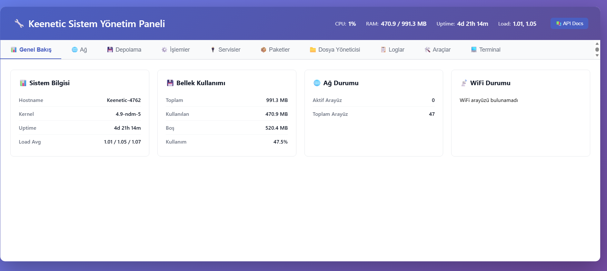

# Keenetic OPKG Web Manager 🚀

[](https://www.gnu.org/licenses/gpl-3.0)


[TR] Keenetic yönlendiriciler için hafif, Python tabanlı bir OPKG paket yönetim arayüzü.
[EN] A lightweight, Python-based OPKG package management interface for Keenetic routers.

---

## 📸 Screenshot / Ekran Görüntüsü


**Default URL / Varsayılan URL:** `http://192.168.1.1:5000`

---

## 🇹🇷 Türkçe Açıklama

Bu proje, Keenetic cihazlar üzerindeki Entware (OPKG) paketlerini modern bir web arayüzü üzerinden yönetmenizi sağlar.

### ✨ Özellikler
* **Canlı Liste:** `opkg list` ile güncel repo verilerini çeker.
* **Durum Kontrolü:** Paketlerin yüklü olup olmadığını otomatik tespit eder.
* **Tek Tıkla İşlem:** Hızlı paket yükleme ve kaldırma butonları.
* **Entegre Terminal:** İşlem çıktılarını anlık izleme.

### 🛠 Kurulum ve Otomatik Başlatma
1. **Gereksinimler:** `opkg install python3 python3-pip && pip install flask`
2. **Dosya Yapısı:** Dosyaları `/opt/etc/my_manager/` altına kopyalayın.
3. **Servis Ayarı:** `/opt/etc/init.d/S99package_manager` dosyasını oluşturun ve aşağıdaki betiği yapıştırın.

---

## 🇺🇸 English Description

This project allows you to manage Entware (OPKG) packages on Keenetic devices via a modern web dashboard.

### ✨ Features
* **Live Listing:** Fetches real-time data using `opkg list`.
* **Status Check:** Automatically detects installed packages (INSTALLED/REPO).
* **One-Click Actions:** Fast buttons for package installation and removal.
* **Integrated Terminal:** Monitor process outputs directly from the UI.

### 🛠 Installation & Autostart
1. **Requirements:** `opkg install python3 python3-pip && pip install flask`
2. **File Structure:** Place files into `/opt/etc/my_manager/`.
3. **Autostart:** Create `/opt/etc/init.d/S99package_manager` and use the script below.

---

## 📂 Service Script / Servis Betiği
`/opt/etc/init.d/S99package_manager`:

```bash
#!/bin/sh
NAME="Keenetic_OPKG_Manager"
PROG="/opt/etc/my_manager/app.py"
PYTHON="/opt/bin/python3"
LOG_FILE="/opt/etc/my_manager/manager.log"

case "$1" in
    start)
        if [ -z "$(ps | grep "$PROG" | grep -v grep)" ]; then
            $PYTHON $PROG > $LOG_FILE 2>&1 &
            echo "$NAME started."
        fi
        ;;
    stop)
        kill $(ps | grep "$PROG" | grep -v grep | awk '{print $1}')
        echo "$NAME stopped."
        ;;
    restart)
        $0 stop && sleep 2 && $0 start
        ;;
    *)
        echo "Usage: $0 {start|stop|restart}"
        exit 1
        ;;
esac
